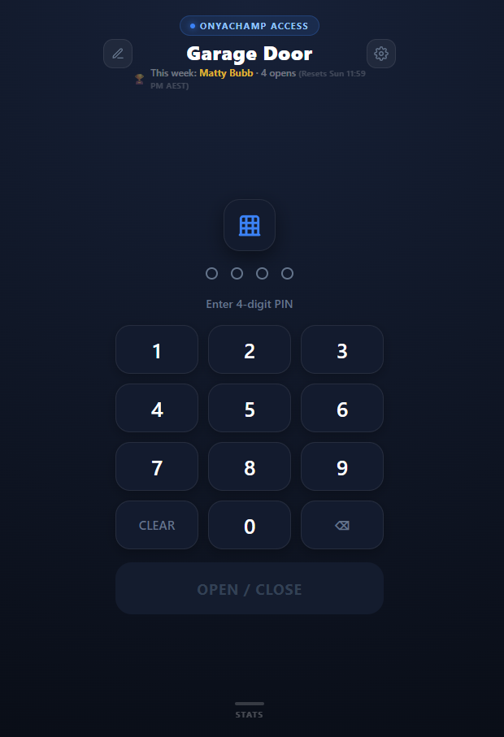
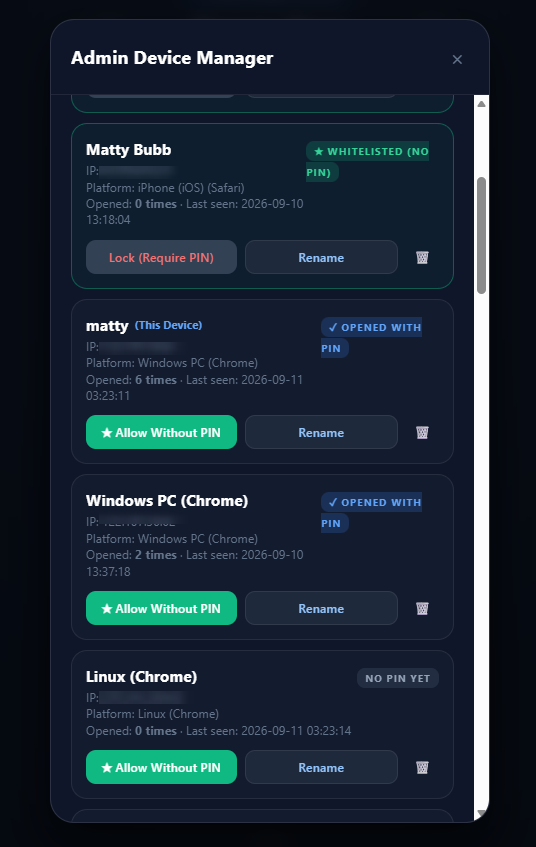
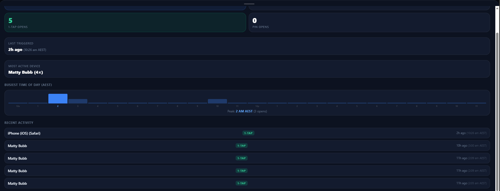
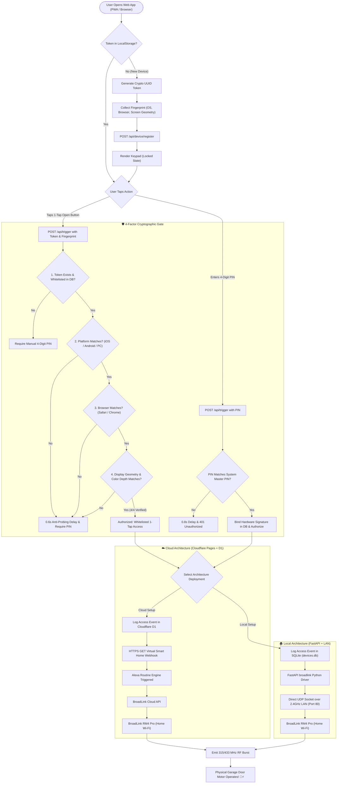

# BroadLink RM4 Pro Smart Garage Door Controller

**Repository:** [github.com/thebubbsy/broadlink-garage-controller](https://github.com/thebubbsy/broadlink-garage-controller) · [Cloud setup](cloud-cloudflare-pages/README.md) · [Local setup](local-python/README.md) · [Change the PIN](#-changing-the-pin)


An open-source, mobile-friendly smart garage door controller designed for the **BroadLink RM4 Pro**. 

Provides secure, convenient 1-tap door access for family and trusted neighbors without requiring dedicated app installations or accounts, backed by a **4-factor cryptographic device verification gate** and an **interactive admin console**.

---

## 🌟 Why This Project?

Most smart garage solutions require expensive proprietary hardware, subscription fees, or forcing every family member and neighbor to download a clunky 150MB mobile app and create an account.

This project uses an affordable **BroadLink RM4 Pro** to capture and transmit the RF remote signal of your existing garage door motor, paired with a sleek, installable web PWA that works on any phone. 

To cater to different home setups, the project provides **two distinct, production-ready architectures**:

1. **Cloud Architecture (`cloud-cloudflare-pages/`)**:
   - 100% serverless on Cloudflare's free tier.
   - Hosted on **Cloudflare Pages** + **Cloudflare D1 SQL Database**.
   - Bridges to the RM4 Pro via Alexa Routine / Webhook.
   - **Zero home PC or server needs to be powered on 24/7**.

2. **Local Architecture (`local-python/`)**:
   - 100% self-hosted with zero external cloud dependencies.
   - Built on **Python (FastAPI)** + **SQLite**.
   - Directly controls the RM4 Pro via UDP sockets on your local 2.4GHz Wi-Fi network.
   - Can run on Windows, Linux, Raspberry Pi, or **an old repurposed Android smartphone (via Termux)**!

---

## 📸 Screenshots & UI Tour

<div align="center">

| Mobile Keypad & Weekly Leaderboard | Admin Device Console |
| :---: | :---: |
|  |  |

### Live Usage Statistics & Peak Hour Analytics


</div>

---

## ⚖️ Architecture Comparison

| Feature | Cloud (`cloud-cloudflare-pages/`) | Local (`local-python/`) |
| :--- | :--- | :--- |
| **Hosting Platform** | Cloudflare Pages + D1 Database | FastAPI / Uvicorn + SQLite |
| **Home Hardware Required** | RM4 Pro only | RM4 Pro + Host (PC / Pi / Android) |
| **PC Powered On 24/7?** | ❌ **No** (Completely serverless) | ✅ Yes (or low-power Android / Pi) |
| **External Cloud Dependency** | Cloudflare + Alexa / Webhook | ❌ **Zero** (100% local LAN) |
| **RF Code Learning** | BroadLink app (learn button → scene → Alexa Routine) | Built-in `learn_rf.py` CLI sweep & capture |
| **Multi-Burst RF Transmit** | Via BroadLink Scene (add the button 3× to the scene) | `RF_BURST_COUNT` in `.env` (default 3, `1` = off) |
| **4-Factor Device Verification** | ✅ Yes (D1 edge database) | ✅ Yes (SQLite database) |
| **Admin Whitelist & Nicknames** | ✅ Yes | ✅ Yes |
| **"Hey Siri" Shortcut** | ✅ Yes (per-device Siri link) | ✅ Yes (per-device Siri link) |
| **Weekly Top User Leaderboard** | ✅ Yes (Sunday 11:59 PM reset) | Optional |
| **Mobile PWA Support** | ✅ Yes | ✅ Yes |
| **Cost** | $0.00 / month (Cloudflare Free Tier) | $0.00 (Self-hosted) |

---

## 🔄 End-to-End Process & Decision Workflow

The diagram below illustrates the unified user journey, the strict **4-Factor Security Gate**, and the dispatch branching between the **Cloud** and **Local** architectures:



---

## 🛡️ Strict 4-Factor Security Gate

Both solutions feature an intelligent security gate that allows whitelisted devices to trigger the garage door with **1 tap** (no PIN required) while maintaining rock-solid defense against unauthorized access:

1. **Cryptographic Device Token**: A unique, high-entropy UUID stored in the client\'s persistent browser storage.
2. **Platform / OS Family**: Enforces matching operating system family (e.g., iOS vs Android vs Windows).
3. **Browser Engine Family**: Enforces matching browser engine signatures (Safari vs Chrome vs Firefox).
4. **Hardware Display Geometry**: Verifies display resolution, pixel ratio, and color depth fingerprint.

If an unapproved device attempts access, or if any of the 4 conditions mismatch, the gate drops back to requiring the master numeric PIN with automated delay against brute-force probing.

---

## 🏆 Key Features

- **Any-Length PIN**: `GARAGE_PIN` can be 1–32 digits. The keypad reads the length from the server and renders one dot per digit — no code change needed to move from a 4-digit to a 10-digit PIN.
- **PWA Mobile App**: Install to your iOS or Android home screen with a single tap. Features dark modern UI, responsive haptic feedback, and audio cues.
- **Master Admin Drawer**: Whitelist trusted neighbors, assign custom nicknames (e.g., "Dad", "Sarah\'s Phone"), or revoke access in real time.
- **Weekly Leaderboard**: Displays the top user of the week with access counts, resetting automatically every Sunday at 11:59 PM.
- **Usage Statistics** (private): Visualizes peak trigger times throughout the day and all-time access counts. Because this history reveals when the household comes and goes, the stats drawer and weekly leaderboard are visible **only to 1-Tap verified devices and administrators** — everyone else gets no button and a 403 from the API.
- **"Hey Siri, open garage door"**: Whitelisted devices can enable a private Siri link and a 2-action Apple Shortcut — works from the lock screen, CarPlay and Apple Watch. Siri opens are logged and counted like any other; revoking 1-Tap revokes the link.
- **RF Remote Learning** — how the garage remote's signal is captured differs by architecture:
  - **Local (`local-python/`)**: Built-in CLI tool (`learn_rf.py`) sweeps carrier frequencies, locks onto your physical remote's RF code packet and saves it to `garage_rf_code.txt`. The server then transmits it directly over the LAN. *Local version only.*
  - **Cloud (`cloud-cloudflare-pages/`)**: No CLI learning. You learn the remote button inside the **BroadLink mobile app**, add that button to a **BroadLink Scene**, link BroadLink to **Alexa**, and create an Alexa Routine that runs the scene when the webhook fires. See the cloud README, Step 4.

---

## 🔢 Changing the PIN

One command, either architecture. PINs can be **1–32 digits** — the keypad reads the length from the server and draws one dot per digit.

**Cloud** (`cloud-cloudflare-pages/`) — sets an encrypted Cloudflare secret and redeploys for you:

```bash
cd cloud-cloudflare-pages
npm run pin
```

**Local** (`local-python/`) — updates `.env`, then restart the server:

```bash
cd local-python
python change_pin.py
```

Both ask which PIN (`user` or `admin`), take the new value twice without echoing it, and refuse anything that isn't 1–32 digits. To skip the prompts: `npm run pin -- admin 483920` or `python change_pin.py admin 483920`.

Full details: [cloud guide](cloud-cloudflare-pages/README.md#-changing-the-pin) · [local guide](local-python/README.md#-changing-the-pin).

---

## 📁 Repository Structure

```text
.
├── cloud-cloudflare-pages/     # Serverless Cloudflare Pages + D1 implementation
│   ├── functions/api/          # Edge API routes (verify, trigger, stats, weekly)
│   ├── public/                 # Client PWA (HTML, CSS, JS, manifest, icons)
│   ├── schema.sql              # D1 devices table schema
│   ├── schema_v2.sql           # D1 events & weekly stats schema
│   ├── wrangler.toml.example   # Example Cloudflare Wrangler config
│   └── README.md               # Detailed Cloudflare deployment instructions
│
├── local-python/               # Self-hosted FastAPI + BroadLink LAN implementation
│   ├── database.py             # SQLite device repository & 4-factor signature engine
│   ├── discover.py             # Automatic RM4 Pro LAN discovery script
│   ├── learn_rf.py             # Interactive RF frequency sweep and code grabber
│   ├── test_trigger.py         # Signal test utility
│   ├── server.py               # FastAPI web server and admin API
│   ├── garage_rf_service.py    # Background Windows Service daemon
│   ├── requirements.txt        # Python dependencies
│   ├── .env.example            # Environment template
│   └── README.md               # Detailed local, Windows service & Android guide
│
├── LICENSE                     # MIT License
└── README.md                   # Project overview & documentation
```

---

## 🚀 Getting Started

Choose the path that best suits your setup:

- **Want 24/7 cloud access with no PC or server turned on?**  
  👉 Follow the [Cloudflare Pages Deployment Guide](cloud-cloudflare-pages/README.md).

- **Want a 100% offline/local solution on a Raspberry Pi, Windows PC, or an old Android phone?**  
  👉 Follow the [Local Python Server Guide](local-python/README.md).

---

## ⚠️ Security Notice & Best Practices

- Always change the default `GARAGE_PIN` and `GARAGE_ADMIN_PIN` values before deploying.
- Never commit your captured `garage_rf_code.txt`, Cloudflare D1 UUIDs, or private webhook URLs to public repositories.
- Keep the admin PIN strictly restricted to household administrators.

---

## 📄 License

Distributed under the [MIT License](LICENSE).


