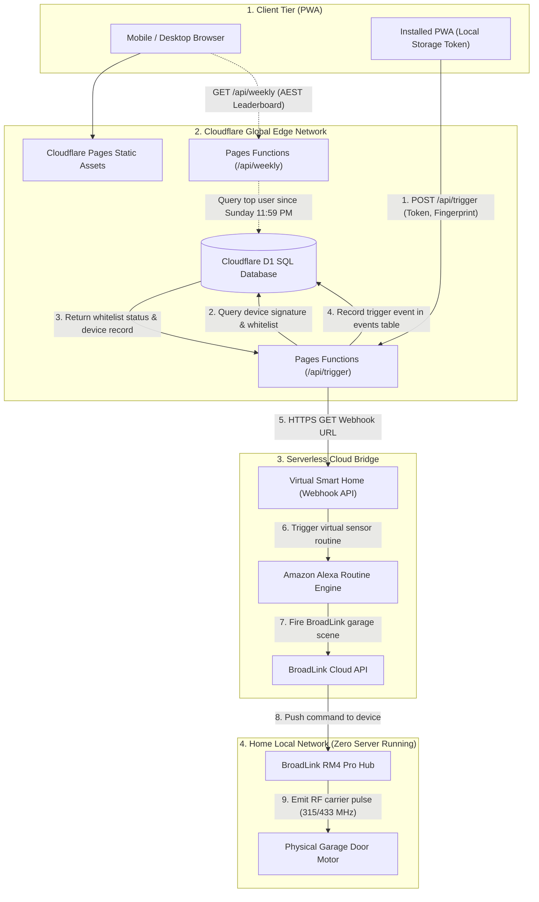
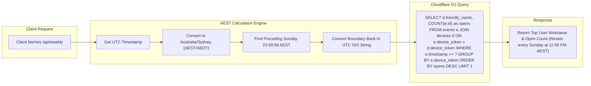

# Cloud Architecture: Cloudflare Pages + D1 + BroadLink Cloud / Alexa

A 100% serverless, zero-maintenance smart garage door controller hosted on **Cloudflare Pages** with an edge **Cloudflare D1 SQL database**.

This setup allows you to control your garage door 24/7 with **zero local servers or home PCs turned on**.

---

## 🏗️ Architecture & Dataflow Diagrams

### End-to-End System Topology



### Request Lifecycle & Asynchronous Execution Flow

```mermaid
sequenceDiagram
    autonumber
    actor User as User / Phone
    participant Browser as Client PWA
    participant CF as Cloudflare Pages (/api/trigger)
    participant D1 as Cloudflare D1 Database
    participant Webhook as Virtual Smart Home Webhook
    participant Alexa as Amazon Alexa Service
    participant BLCloud as BroadLink Cloud
    participant RM4 as BroadLink RM4 Pro (Home LAN)
    participant Garage as Garage Door Motor

    User->>Browser: Taps Open Garage Door
    Browser->>CF: POST /api/trigger (token, fingerprint, pin?)
    
    rect rgb(20, 30, 50)
        note over CF,D1: 4-Factor Authentication Verification
        CF->>D1: SELECT * FROM devices WHERE device_token = ?
        D1-->>CF: Device Record (whitelist, platform, browser, display_hw)
        alt Whitelisted & 4/4 Factors Match
            CF->>CF: Authorize 1-Tap Access
        else Signature Mismatch or Unwhitelisted
            CF->>CF: Verify Submitted 4-Digit PIN
        end
    end

    CF->>D1: INSERT INTO events (device_token, event_type, timestamp)
    CF->>Webhook: HTTPS GET activate.php (trigger & token)
    Webhook-->>CF: 200 OK (Virtual sensor triggered)
    CF-->>Browser: 200 OK (Door triggered successfully)
    Browser-->>User: Success Animation & Haptic Buzz

    note over Webhook,Garage: Asynchronous Cloud-to-Hardware Execution
    Webhook->>Alexa: Trigger Virtual Sensor Event
    Alexa->>Alexa: Execute Garage Door Routine
    Alexa->>BLCloud: Activate BroadLink Smart Device Scene
    BLCloud->>RM4: Send Learned RF Command
    RM4->>Garage: Transmit 315/433 MHz Radio Frequency Signal
    Garage->>Garage: Motor Engages - Door Opens/Closes
```



### AEST Rolling Weekly Leaderboard Logic



---

## ✨ Features

- **No Home Server Required**: Runs entirely on Cloudflare's global free tier. Home PC can be completely powered off.
- **4-Factor Device Verification**: Once an authorized user enters the PIN once and you whitelist them from the Admin console, they can trigger the door with **1 tap** (no PIN re-entry). The edge worker cryptographically verifies:
  1. High-entropy UUID device token stored in browser storage.
  2. Operating system / platform family (iOS, Android, Windows, Mac).
  3. Browser engine family (Safari, Chrome, Firefox).
  4. Hardware display geometry & color depth fingerprint.
- **Interactive Admin Drawer**:
  - Whitelist or revoke access with 1 toggle.
  - Assign friendly nicknames to family/neighbors.
  - Delete stale devices.
- **Fun Stats & Weekly Leaderboard**:
  - Tracks total door triggers.
  - Real-time weekly leaderboard ("Top User") with automatic reset every Sunday at 11:59 PM (AEST).
  - Displays personalized user nicknames instead of raw device strings.
  - Shows peak trigger times of day.
- **Mobile PWA Ready**: Installable to iOS and Android home screens as a native full-screen app with custom icons and splash screen.

---

## 🚀 Setup & Deployment Guide

### Prerequisites
- A free [Cloudflare Account](https://dash.cloudflare.com/)
- Node.js 18+ installed locally
- A [BroadLink RM4 Pro](https://www.ibroadlink.com/) set up on your 2.4GHz Wi-Fi network and paired in the BroadLink mobile app.
- An Alexa Echo device or the Amazon Alexa app.

---

### Step 1: Clone and Install Dependencies

```bash
cd cloud-cloudflare-pages
npm install
```

---

### Step 2: Create Cloudflare D1 Database

Log in to Wrangler:
```bash
npx wrangler login
```

Create your D1 database:
```bash
npx wrangler d1 create garage-db
```

Wrangler will output something like:
```toml
[[d1_databases]]
binding = "DB"
database_name = "garage-db"
database_id = "xxxxxxxx-xxxx-xxxx-xxxx-xxxxxxxxxxxx"
```

Copy `wrangler.toml.example` to `wrangler.toml` and paste your `database_id`:
```bash
cp wrangler.toml.example wrangler.toml
```

---

### Step 3: Run Database Migrations

Apply the database schemas to your remote Cloudflare D1 database:

```bash
# Apply devices schema
npx wrangler d1 execute garage-db --remote --file=schema.sql

# Apply events and stats schema
npx wrangler d1 execute garage-db --remote --file=schema_v2.sql
npx wrangler d1 execute garage-db --remote --file=schema_v3.sql
npx wrangler d1 execute garage-db --remote --file=schema_v4.sql
```

> Fresh install? `schema.sql` already contains everything — the numbered files are additive migrations for databases created earlier.

---

### Step 4: Learn the Remote in the BroadLink App & Configure the Webhook Trigger

> **Note:** The cloud version does **not** use the `learn_rf.py` CLI tool from `local-python/` — that tool talks to the RM4 Pro over your LAN, which a Cloudflare edge function cannot reach. Instead, the remote is learned inside the BroadLink app and fired through Alexa.

**4a. Learn the garage button and put it in a Scene (BroadLink app)**

1. Open the **BroadLink** app and select your **RM4 Pro**.
2. Tap **+ Add** → **Remote control** → choose **RF** (not IR) and a generic type such as *Curtain* / *Light* / *Custom*.
3. Tap **Learn**, then press and hold your physical garage remote's button until the app confirms the frequency lock, release, and press it again when prompted to capture the code. Name the button (e.g. `Garage`).
4. Test the new button in the app — your door should move.
5. Create a **Scene** (BroadLink app → **Scenes** → **+**), e.g. `Garage Door`. Alexa can run scenes but cannot press individual learned buttons, so this step is required.
   - **Multi-burst (recommended):** the cloud version cannot repeat the RF send itself — the RM4 Pro is driven by the scene, not by this code. To fire the code more than once per trigger, add the same `Garage` button to the scene **multiple times** (e.g. 3×) with no delay between them; the RM4 Pro then transmits it 3× in quick succession, which garage receivers pick up far more reliably than a single packet. This is the equivalent of the local version's `RF_BURST_COUNT=3`. **Do not** try to get a burst by calling the webhook repeatedly — each call is a separate Alexa Routine run seconds apart and would open / stop / close the door.
6. In the **Amazon Alexa app**: **More → Skills & Games**, enable the **BroadLink** skill and sign in, then **Discover Devices**. The `Garage Door` scene should appear under **Scenes**.

**4b. Bridge Cloudflare → Alexa with a webhook**

To reach Alexa from a Cloudflare Pages function without running local servers, use a cloud webhook bridge such as **Virtual Smart Home (URL Routine Trigger)** or **Home Assistant Cloud**:

1. Visit [Virtual Smart Home](https://www.virtualsmarthome.xyz/url_routine_trigger/) and log in with your Amazon account.
2. Create a new trigger button (e.g., `Garage Door Trigger`).
3. Note the generated unique webhook URL.
4. In the **Amazon Alexa app**:
   - Install the **URL Routine Trigger** skill.
   - Create an Alexa Routine:
     - **When**: Smart Home -> `Garage Door Trigger` opens/triggers.
     - **Action**: Smart Home -> **Scenes** -> `Garage Door` (the BroadLink scene from 4a).
5. Add the webhook URL to your `wrangler.toml` under `[vars]` as `GARAGE_WEBHOOK_URL`.
6. Test it: open the webhook URL in a browser — Alexa should run the routine and the door should move. If the routine fires but the door doesn't, re-check that the routine targets the scene (not the raw button).

---

## 🔒 Private Usage History

The app is hosted on public infrastructure, and the stats drawer and weekly leaderboard show when people come and go. Both are therefore restricted:

- `POST /api/stats` and `POST /api/weekly` answer only **1-Tap whitelisted devices** (by `device_token`) and **administrators** (a device flagged `is_admin`, or the correct `admin_pin`). Everything else gets `403` and no data.
- `GET` on either endpoint always returns `403`, so pasting the URL into a browser reveals nothing.
- Credentials travel in the POST body, never in the query string, so device tokens and admin PINs stay out of URLs, edge logs and browser history.
- Blocked devices are refused even if still whitelisted.
- The front-end hides the Stats handle and the weekly banner unless the device qualifies — but the server is what enforces it.

Run `npm test` in `cloud-cloudflare-pages/` to verify the rules (14 cases, no account or network needed).

---

## 🎙 "Hey Siri, open garage door" (Apple Shortcuts)

Whitelisted (1-Tap) devices can enable Siri from the app: tap **🎙 Set up "Hey Siri"** on the verified card. The app issues a private per-device link (`/api/siri/trigger?key=…`, 256-bit key) and shows a 5-step recipe for a 2-action Apple Shortcut (**Get Contents of URL** → **Show Result**). Name it *Open garage door* and Siri runs it from the lock screen, CarPlay or Apple Watch.

- Every Siri open goes through the same path as a tap in the app: counted on the device, logged as an event (`auth_method: siri`), included in stats, peak hours and the weekly leaderboard, and fires the same door trigger.
- The link only works while the device has 1-Tap access. Revoking 1-Tap in the admin panel (or the user tapping **Disable Siri**) kills it immediately; **Regenerate link** rotates it.
- Android users can use the same link with the free *HTTP Shortcuts* app / a Google Assistant routine.

### Optional: ready-made "Download Shortcut" button

Export the Shortcut once and host the file; the Siri modal detects it and shows **⬇️ Download Shortcut** above the manual steps. Users import it, paste their own private link into the *Get Contents of URL* action, and say *"Hey Siri, open garage door."*

1. Shortcuts → **+** → name it **Open garage door**.
2. Add **Get Contents of URL** with the placeholder URL `https://garage.onyachamp.com/api/siri/trigger?key=PASTE-YOUR-LINK-HERE`.
3. Add **Show Result** (or a *Show Alert* saying "Garage door has been opened").
4. Tap **ⓘ → Share → Save to Files** and rename it `Open_garage_door.shortcut`.
5. Put it in `public/shortcuts/` and deploy. It is served at `/shortcuts/Open_garage_door.shortcut`.

> ⚠️ The `.shortcut` file is Apple-signed and embeds whatever URL was in it at export time — it cannot be edited afterwards. **Never export it with a real Siri link inside**; anyone who downloads it could open the door. If that ever happens, tap **Regenerate link** in the app.

Alternatively set `SIRI_SHORTCUT_URL` to an iCloud-shared Shortcut link; it's used when no file is hosted.

> Security note: the Siri link is a plain bearer secret — it deliberately skips the browser-signature checks because Shortcuts isn't a browser. It's only issued to already-whitelisted devices and is revocable, so it's no weaker than the device token, but treat it like a key: don't share it, and don't open it in a browser (it triggers the door).

---

### Step 5: Configure Environment Variables

Edit `wrangler.toml`:

```toml
[vars]
GARAGE_PIN = "1234"        # Fallback 4-digit PIN for unwhitelisted devices
GARAGE_ADMIN_PIN = "0000"  # Master Admin PIN to open Admin console
GARAGE_WEBHOOK_URL = "https://www.virtualsmarthome.xyz/url_routine_trigger/activate.php?trigger=YOUR_ID&token=YOUR_TOKEN"
SIRI_SHORTCUT_URL = ""     # Optional: iCloud link to your shared "Open garage door" Shortcut (see Hey Siri section)
```

---

### Step 6: Deploy to Cloudflare Pages

```bash
npx wrangler pages deploy public
```

Your smart garage portal is now live at `https://<your-project-name>.pages.dev`!

---

## 📱 Mobile Installation (PWA)

1. Open your Cloudflare Pages URL in **Safari** (iOS) or **Chrome** (Android).
2. iOS: Tap **Share** -> **Add to Home Screen**.
3. Android: Tap the **three dots menu** -> **Add to Home screen** or **Install app**.
4. The controller runs as a standalone full-screen app with haptic feedback.
