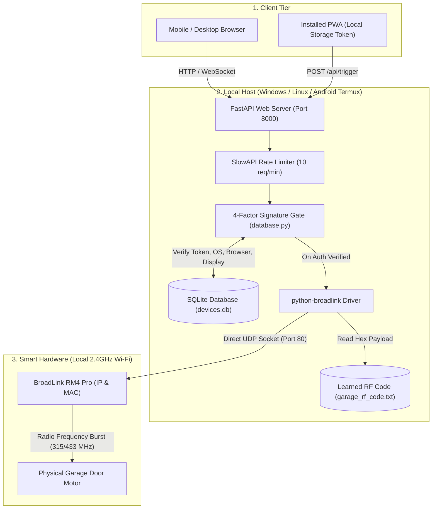
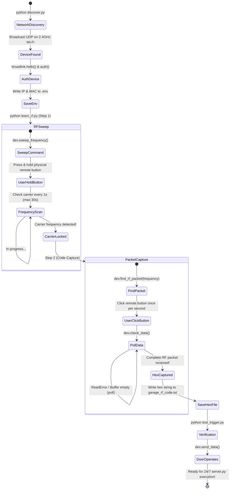

# Local Architecture: Python (FastAPI) + BroadLink LAN Control

A lightweight, self-hosted smart garage door controller powered by **Python**, **FastAPI**, and **SQLite**.

Communicates directly with your **BroadLink RM4 Pro** over local Wi-Fi UDP sockets, eliminating third-party cloud dependencies.

Can run on **Windows**, **Linux**, a **Raspberry Pi**, or even an **old Android smartphone** running Termux.

---

## 🏗️ Architecture & Process Diagrams

### Local Network Topology & Direct Socket Architecture



### RF Frequency Sweep & Remote Learning State Machine



---

## ✨ Features

- **Direct LAN Communication**: Millisecond response time with zero external cloud dependencies.
- **"Hey Siri" Shortcut**: Whitelisted devices get a private Siri link and a 2-action Apple Shortcut recipe — see the Hey Siri section below.
- **Multi-Burst RF Transmit**: Every trigger sends the learned code 3× in quick succession (150 ms apart) for rock-solid reception. Set `RF_BURST_COUNT` in `.env` to any integer (`1` disables the burst) and `RF_BURST_GAP_MS` for the spacing.
- **Automated RF Learning**: Interactive script sweeps radio frequencies, locks onto your physical garage remote's signal, and saves the binary packet.
- **4-Factor Device Verification Gate**:
  1. Cryptographic Device Token
  2. Operating System Family (iOS / Android / Windows / Linux / macOS)
  3. Browser Engine Family (Safari / Chrome / Firefox)
  4. Hardware Display Geometry Fingerprint
- **Admin Management Panel**: Whitelist devices, assign friendly names, view access logs, and delete stale devices.
- **Ultra Low Power Consumption**: Can run 24/7 on an unused spare Android phone drawing under 2 Watts.

---

## 🎙 "Hey Siri, open garage door" (Apple Shortcuts)

Whitelisted (1-Tap) devices can enable Siri from the app: tap **🎙 Set up "Hey Siri"** on the verified card. The app issues a private per-device link (`/api/siri/trigger?key=…`, 256-bit key) and shows a 5-step recipe for a 2-action Apple Shortcut (**Get Contents of URL** → **Show Result**). Name it *Open garage door* and Siri runs it from the lock screen, CarPlay or Apple Watch.

- Every Siri open goes through the same path as a tap in the app: counted on the device, logged as an event (`auth_method: siri`), included in stats, peak hours and the weekly leaderboard, and fires the same door trigger.
- The link only works while the device has 1-Tap access. Revoking 1-Tap in the admin panel (or the user tapping **Disable Siri**) kills it immediately; **Regenerate link** rotates it.
- Android users can use the same link with the free *HTTP Shortcuts* app / a Google Assistant routine.

### Optional: ready-made "Download Shortcut" button

Export the Shortcut once and host the file; the Siri modal detects it and shows **⬇️ Download Shortcut** above the manual steps. Users import it, paste their own private link into the *Get Contents of URL* action, and say *"Hey Siri, open garage door."*

1. Shortcuts → **+** → name it **Open garage door**.
2. Add **Get Contents of URL** with the placeholder URL `https://garage.onyachamp.com/api/siri/trigger?key=PASTE-YOUR-LINK-HERE`.
3. Add **Show Result** (or a *Show Alert* saying "Garage door has been opened").
4. Tap **ⓘ → Share → Save to Files** and rename it `Open_garage_door.shortcut`.
5. Put it in `local-python/shortcuts/` and deploy. It is served at `/shortcuts/Open_garage_door.shortcut`.

> ⚠️ The `.shortcut` file is Apple-signed and embeds whatever URL was in it at export time — it cannot be edited afterwards. **Never export it with a real Siri link inside**; anyone who downloads it could open the door. If that ever happens, tap **Regenerate link** in the app.

Alternatively set `SIRI_SHORTCUT_URL` to an iCloud-shared Shortcut link; it's used when no file is hosted.

> Security note: the Siri link is a plain bearer secret — it deliberately skips the browser-signature checks because Shortcuts isn't a browser. It's only issued to already-whitelisted devices and is revocable, so it's no weaker than the device token, but treat it like a key: don't share it, and don't open it in a browser (it triggers the door).

---

## 🛠️ Hardware Requirements

1. **BroadLink RM4 Pro** (must be the Pro model which includes RF 315/433 MHz transmitter and IR).
2. **Physical Garage Door Remote Control** (fixed code or compatible multi-frequency remote).
3. **Host Device on the Same Local Wi-Fi Network**:
   - Spare Android phone (via Termux)
   - Raspberry Pi / Linux mini PC
   - Windows PC

> **Important Note on BroadLink Setup**:
> When setting up the RM4 Pro in the official BroadLink mobile app:
> 1. Complete the standard Wi-Fi onboarding.
> 2. Go to **Device Settings** in the BroadLink app.
> 3. Turn **OFF** the toggle for **"Lock device"**. (If locked, local third-party SDK connections will be rejected).

---

## 📦 Quickstart Installation

### 1. Set Up Python Environment

Python 3.9+ is recommended:

```bash
# Clone the repository and navigate to local-python
cd local-python

# Create a virtual environment (optional but recommended)
python -m venv venv

# Activate virtual environment
# On Windows:
.\venv\Scripts\activate
# On Linux / macOS / Android:
source venv/bin/activate

# Install dependencies
pip install -r requirements.txt
```

### 2. Discover RM4 Pro on Local Network

Ensure your computer/host is connected to the same Wi-Fi subnet as the BroadLink RM4 Pro:

```bash
python discover.py
```

This will discover the RM4 Pro, authenticate with it, and automatically generate your `.env` configuration with its IP and MAC address.

### 3. Learn RF Remote Signal

Run the interactive frequency sweep and packet capture tool:

```bash
python learn_rf.py
```

Follow the on-screen prompts:
1. **Step 1**: Press and hold your garage remote button until the RM4 Pro locks onto the RF carrier frequency.
2. **Step 2**: Release the button, then click the remote button repeatedly every second until the RF packet is captured.
3. The captured binary hex code is automatically saved to `garage_rf_code.txt`.

### 4. Test RF Transmission

Verify that your RM4 Pro can trigger your physical garage door:

```bash
python test_trigger.py
```

If your door activates, you are ready to start the web server!

### 5. Start the Web Server

```bash
python server.py
# Or on Windows PowerShell:
.\start.ps1
```

Access the web interface in your browser at `http://<your-host-ip>:8000`.

---

## 📱 Running on an Android Phone (Termux)

You can repurpose an old Android smartphone as a dedicated, silent, 24/7 smart garage server:

### 1. Install Termux
- Download and install **Termux** from [F-Droid](https://f-droid.org/packages/com.termux/) or GitHub Releases (do not use the deprecated Google Play version).

### 2. Prevent Android from Sleeping
Open Termux and run:
```bash
termux-wake-lock
```
Also go to Android Settings -> Apps -> Termux -> **Battery** -> set to **Unrestricted** (turn off battery optimization).

### 3. Install Python & Git
Inside Termux, run:
```bash
pkg update -y
pkg install -y python git clang
```

### 4. Clone & Set Up Project
```bash
git clone https://github.com/thebubbsy/broadlink-garage-controller.git
cd broadlink-garage-controller/local-python
pip install -r requirements.txt
```

### 5. Discover & Learn or Copy RF Code
- Run `python discover.py` to link to your BroadLink RM4 Pro on your home Wi-Fi.
- Either run `python learn_rf.py` or paste your pre-captured `garage_rf_code.txt`.
- Copy `.env.example` to `.env` and set your desired `GARAGE_PIN` and `GARAGE_ADMIN_PIN`.

### 6. Run Server in Background
```bash
nohup python server.py > server.log 2>&1 &
```
Find your Android phone\'s local IP address (Settings -> Wi-Fi or run `ip route` in Termux). You can now access your garage portal from any device on your Wi-Fi network at `http://<android-ip>:8000`!

*(Optional: Install `Termux:Boot` from F-Droid to automatically launch `server.py` whenever the phone reboots).*

---

## 🪟 Windows Background Service Setup

If running on a Windows PC or home server, you can install `server.py` as a Windows Service so the web app starts automatically on boot and keeps running without a logged-in user. It reads the same `.env` file and writes logs to `garage_service.log`:

```powershell
# In an elevated PowerShell prompt (Run as Administrator):
python garage_rf_service.py install
python garage_rf_service.py start

# To stop or remove:
python garage_rf_service.py stop
python garage_rf_service.py remove

# To run it in the foreground for troubleshooting:
python garage_rf_service.py debug
```

> If `start` fails with a "module not found" error, run `python -m pywin32_postinstall -install` once as Administrator, then start the service again. `pywin32` is installed automatically by `requirements.txt` on Windows.

---

## 🐧 Linux / Raspberry Pi systemd Service

To run as a systemd service on Ubuntu, Debian, or Raspberry Pi OS:

Create `/etc/systemd/system/smart-garage.service`:

```ini
[Unit]
Description=Smart Garage Controller
After=network.target

[Service]
Type=simple
User=pi
WorkingDirectory=/home/pi/broadlink-garage-controller/local-python
ExecStart=/home/pi/broadlink-garage-controller/local-python/venv/bin/python server.py
Restart=always
RestartSec=5

[Install]
WantedBy=multi-user.target
```

Enable and start:
```bash
sudo systemctl daemon-reload
sudo systemctl enable --now smart-garage
```
